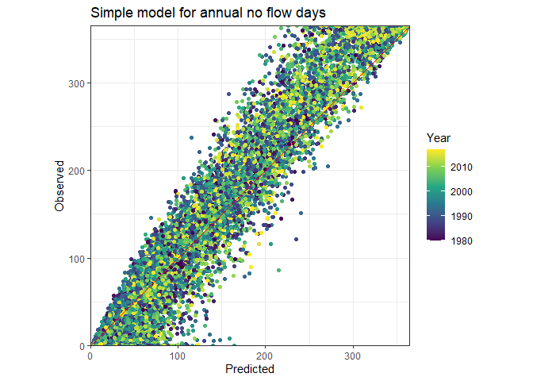

Random Forest - Simple example
================

## Load packages

``` r
library(tidyverse)
```

    ## -- Attaching packages --------------------------------------- tidyverse 1.3.1 --

    ## v ggplot2 3.3.5     v purrr   0.3.4
    ## v tibble  3.1.6     v dplyr   1.0.8
    ## v tidyr   1.2.0     v stringr 1.4.0
    ## v readr   2.1.2     v forcats 0.5.1

    ## -- Conflicts ------------------------------------------ tidyverse_conflicts() --
    ## x dplyr::filter() masks stats::filter()
    ## x dplyr::lag()    masks stats::lag()

``` r
library(tidymodels)
```

    ## Registered S3 method overwritten by 'tune':
    ##   method                   from   
    ##   required_pkgs.model_spec parsnip

    ## -- Attaching packages -------------------------------------- tidymodels 0.1.4 --

    ## v broom        0.7.12     v rsample      0.1.1 
    ## v dials        0.1.0      v tune         0.1.6 
    ## v infer        1.0.0      v workflows    0.2.4 
    ## v modeldata    0.1.1      v workflowsets 0.1.0 
    ## v parsnip      0.1.7      v yardstick    0.0.9 
    ## v recipes      0.2.0

    ## -- Conflicts ----------------------------------------- tidymodels_conflicts() --
    ## x scales::discard() masks purrr::discard()
    ## x dplyr::filter()   masks stats::filter()
    ## x recipes::fixed()  masks stringr::fixed()
    ## x dplyr::lag()      masks stats::lag()
    ## x yardstick::spec() masks readr::spec()
    ## x recipes::step()   masks stats::step()
    ## * Learn how to get started at https://www.tidymodels.org/start/

``` r
library(ranger)
```

## Load data

``` r
df <- read_csv(file.path("..", "results", "00_SelectGagesForAnalysis_GageSampleAnnual.csv"))
```

    ## Rows: 20520 Columns: 64
    ## -- Column specification --------------------------------------------------------
    ## Delimiter: ","
    ## chr  (2): Sample, lulc_source
    ## dbl (62): gage_ID, currentclimyear, annualnoflowdays, zeroflowfirst, peak2z_...
    ## 
    ## i Use `spec()` to retrieve the full column specification for this data.
    ## i Specify the column types or set `show_col_types = FALSE` to quiet this message.

``` r
names(df)
```

    ##  [1] "gage_ID"          "currentclimyear"  "annualnoflowdays" "zeroflowfirst"   
    ##  [5] "peak2z_length"    "p_mm_cy"          "p_mm_amj"         "p_mm_jas"        
    ##  [9] "p_mm_ond"         "p_mm_jfm"         "pet_mm_cy"        "pet_mm_amj"      
    ## [13] "pet_mm_jas"       "pet_mm_ond"       "pet_mm_jfm"       "T_max_c_cy"      
    ## [17] "T_max_c_amj"      "T_max_c_jas"      "T_max_c_ond"      "T_max_c_jfm"     
    ## [21] "T_min_c_cy"       "T_min_c_amj"      "T_min_c_jas"      "T_min_c_ond"     
    ## [25] "T_min_c_jfm"      "pcumdist10days"   "pcumdist50days"   "pcumdist90days"  
    ## [29] "swe_mm_cy"        "swe_mm_amj"       "swe_mm_jas"       "swe_mm_ond"      
    ## [33] "swe_mm_jfm"       "srad_wm2_cy"      "srad_wm2_amj"     "srad_wm2_jas"    
    ## [37] "srad_wm2_ond"     "srad_wm2_jfm"     "Sample"           "p.pet_cy"        
    ## [41] "swe.p_cy"         "p.pet_jfm"        "swe.p_jfm"        "p.pet_amj"       
    ## [45] "swe.p_amj"        "p.pet_jas"        "swe.p_jas"        "p.pet_ond"       
    ## [49] "swe.p_ond"        "dams_n"           "maxstorage_af"    "normstorage_af"  
    ## [53] "majordams_n"      "wuse_mm"          "irrig_prc"        "harvcrop_prc"    
    ## [57] "lulc_water_prc"   "lulc_dev_prc"     "lulc_forest_prc"  "lulc_barren_prc" 
    ## [61] "lulc_grass_prc"   "lulc_ag_prc"      "lulc_wetland_prc" "lulc_source"

## build a simple model

We will try to predict `annualnoflowdays` based on some climate and land
use variables.

``` r
# define predictors
predictors <- c("p_mm_cy", "pet_mm_cy", "T_max_c_cy", "p.pet_cy", 
                "lulc_water_prc", "lulc_dev_prc", "lulc_wetland_prc",
                "lulc_forest_prc", "lulc_barren_prc", "lulc_grass_prc", "lulc_ag_prc")

# make data frame with some descriptive variables, the target and the predictor variables
fit_data_in <- 
  df %>% 
  dplyr::select(c("gage_ID", "currentclimyear", "annualnoflowdays", all_of(predictors))) %>% 
  subset(complete.cases(.)) # remove any row with an NA value

# set up the model engine
rf_engine <- 
  rand_forest() %>% 
  set_engine("ranger", 
             num.threads = (parallel::detectCores() - 1),
             importance = "permutation") %>% 
  set_mode("regression")

# set up some preprocessing steps
rf_recipe <-
  fit_data_in %>% 
  # predict annualnoflowdays based on all the other variables
  recipe(annualnoflowdays ~ .) %>%
  # tell model which variables to not use in the prediction (ID variables)
  update_role(gage_ID, currentclimyear, new_role = "ID")

# combine into a workflow
rf_workflow <-
  workflow() %>% 
  add_model(rf_engine) %>% 
  add_recipe(rf_recipe)
    
# fit model
rf_fit <- 
  rf_workflow %>% 
  fit(data = fit_data_in)
```

## look at model performance

``` r
# extract predictions from model
fit_data_in$predicted <- predict(rf_fit, fit_data_in)$.pred

# plot
ggplot(fit_data_in, aes(x = predicted, y = annualnoflowdays, color = currentclimyear)) +
  geom_point() +
  geom_abline(intercept = 0, slope = 1, color = "red") +
  labs(title = "Simple model for annual no flow days") +
  scale_x_continuous(name = "Predicted", expand = c(0,0)) +
  scale_y_continuous(name = "Observed", expand = c(0,0)) +
  scale_color_viridis_c(name = "Year") +
  coord_equal() +
  theme_bw()
```

<!-- -->

## investigate variable importance

``` r
# extract  importance from model
var_imp <- tibble(predictor = names(pull_workflow_fit(rf_fit)$fit$variable.importance),
                  IncMSE = pull_workflow_fit(rf_fit)$fit$variable.importance) %>% 
  arrange(-IncMSE) %>%  # order most to least importance (higher value = greater influence on predictors)
  mutate(predictor_factor = factor(predictor, levels = .$predictor)) # make a factor so they plot in order
```

    ## Warning: `pull_workflow_fit()` was deprecated in workflows 0.2.3.
    ## Please use `extract_fit_parsnip()` instead.
    ## `pull_workflow_fit()` was deprecated in workflows 0.2.3.
    ## Please use `extract_fit_parsnip()` instead.

``` r
ggplot(var_imp, aes(x = predictor_factor, y = IncMSE)) +
  geom_col() +
  theme_bw() +
  theme(axis.text = element_text(angle = 90, hjust = 1)) +
  NULL
```

<!-- -->
